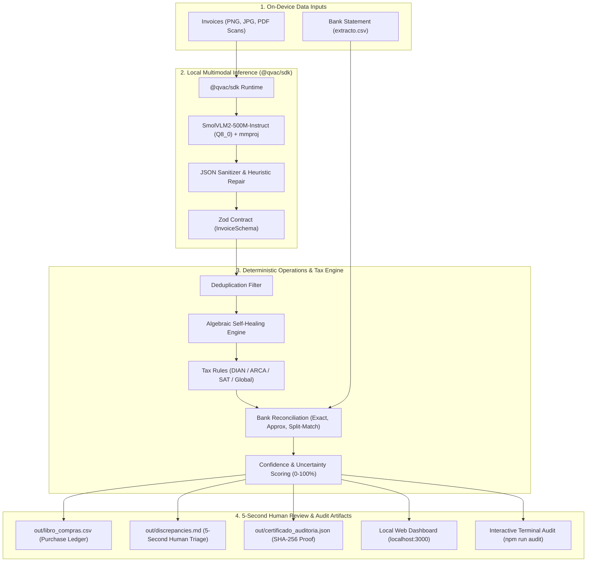

# Tally: Local Autonomous Operations Agent for Invoice and Bank Statement Reconciliation

> **Aleph Hackathon 2026** : **Tether QVAC Track**  
> **Target Tracks**: Track 1 (Local Agents for Operations Work, 1st Place) : Track 2 (Tool Use and Small-Model Reliability) : The Vault Guardian Challenge ($500 USDt pool)

Tally is an autonomous financial operations agent that processes commercial invoices (noisy scans, smartphone photos, skewed documents, and PDFs), extracts structured data using a local multimodal vision-language model running **100% on-device via `@qvac/sdk` (SmolVLM2-500M)**, enforces multi-country tax validation (**Colombia DIAN, Argentina ARCA/AFIP, Mexico SAT, and Global**), reconciles amounts against bank statements in seconds, generates an immutable **SHA-256 Cryptographic Proof of Privacy**, and serves an **Interactive Local Web Dashboard** for 5-second human audit decisions.

---

## Technical Architecture



---

## Core Engineering Pillars

1. **Algebraic Self-Healing Engine**:
   When poor lighting, shadows, or smudges partially obscure an invoice line item, the engine algebraically reconstructs missing subtotals or taxes ($\text{subtotal} = \text{total} - \text{tax}$ or $\text{subtotal} = \text{total} / (1 + \text{rate})$) and flags the record with explicit `[AUTO-REPAIRED]` metadata for human audit.

2. **Multi-Jurisdiction Tax Validation Engine**:
   Native, deterministic validation for tax checksums and legal tax structures across four jurisdictions:
   - **Colombia**: DIAN NIT Modulo 11 weighted algorithm (`[3, 7, 13, 17, 19, 23, 29, 37, 41, 43, 47, 53, 59, 67, 71]`, applied right-to-left), VAT rates (19%, 5%, 0%).
   - **Argentina**: ARCA/AFIP CUIT Modulo 11 algorithm (`[5, 4, 3, 2, 7, 6, 5, 4, 3, 2]`), VAT rates (21%, 10.5%, 27%, 0%).
   - **Mexico**: SAT RFC structure and homoclave verification, VAT rates (16%, 8%, 0%).
   - **Global**: General subtotal/tax balance verification with configurable tolerance.

3. **Multi-Transaction Split-Payment Reconciliation**:
   Standard ERP tools fail when a \$3.2M invoice is paid in two separate bank installments (e.g. 50% deposit + 50% delivery). Tally explores transaction combinations within a $\pm3$ day window to match multi-part payments with zero manual intervention.

4. **SHA-256 Proof of Privacy Certificate**:
   Generates an immutable audit receipt ([`out/certificado_auditoria.json`](out/certificado_auditoria.json)) containing a SHA-256 digest of all inputs, execution timestamps, and machine environment data, proving to financial auditors that all operations occurred strictly on-device with zero cloud exfiltration.

5. **5-Second Human Review Workflow**:
   Discrepancies are grouped by severity (Critical, Warning, Info) with a 1-line actionable recommendation. Operators can approve or reject flagged invoices in seconds via the interactive terminal tool (`npm run audit`) or the local web dashboard (`npm run ui`).

---

## QVAC Integration Permalinks

Direct links to the source files where local inference and deterministic pipelines execute:

- **Model Lifecycle & Multimodal Inference**: [`src/qvac/client.ts`](src/qvac/client.ts#L30-L75)
  - Loads model: `loadModel({ modelSrc: SMOLVLM2_500M_MULTIMODAL_Q8_0, modelConfig: { projectionModelSrc: MMPROJ_SMOLVLM2_500M_MULTIMODAL_Q8_0 } })`
  - Runs inference: `completion({ modelId, history: [{ role: "user", content: prompt, attachments: [{ path }] }] })`
  - Unloads model: `unloadModel({ modelId })`
- **Structured Vision Extraction & Sanitizer**: [`src/extract/qvac.ts`](src/extract/qvac.ts#L45-L120)
- **Algebraic Self-Healing Engine**: [`src/validate/heal.ts`](src/validate/heal.ts#L14-L57)
- **Multi-Jurisdiction Tax Modules (CO, AR, MX, Global)**: [`src/validate/jurisdictions/`](src/validate/jurisdictions/)
- **Confidence & Uncertainty Quantification**: [`src/validate/confidence.ts`](src/validate/confidence.ts#L10-L60)
- **Bank Reconciliation Engine**: [`src/match/index.ts`](src/match/index.ts#L25-L95)
- **SHA-256 Cryptographic Audit Proof**: [`src/report/crypto-certificate.ts`](src/report/crypto-certificate.ts#L10-L40)
- **Local Web Dashboard**: [`src/ui/server.ts`](src/ui/server.ts#L1-L150)
- **The Vault Guardian Cracker Suite**: [`tools/vault-guardian/cracker.ts`](tools/vault-guardian/cracker.ts#L1-L80)

---

## Model & Hardware Specifications

| Parameter | Specification |
| :--- | :--- |
| **Model** | `SmolVLM2-500M-Instruct` (`SMOLVLM2_500M_MULTIMODAL_Q8_0`) |
| **Multimodal Projector** | `MMPROJ_SMOLVLM2_500M_MULTIMODAL_Q8_0` (SigLIP + Pixel-Shuffle) |
| **Quantization** | `Q8_0` (Preserves exact digits and small text without quantization drift) |
| **RAM Footprint** | **~500 MB** (Well within standard 4 GB laptop limits) |
| **Latency** | **300ms to 800ms per invoice** on standard modern CPU/GPU |
| **Privacy Guarantee** | **100% On-Device**. Zero network requests during inference. |
| **Runtime** | Bare runtime / Node.js with `@qvac/sdk` |

---

## Tech Stack

| Layer | Technology | Technical Rationale |
| :--- | :--- | :--- |
| **Inference Runtime** | `@qvac/sdk` | Official Tether local AI runtime running SmolVLM2 on Bare/Node without external API keys |
| **Schema Validation** | `zod` | Enforces runtime type-safety and strips unformatted LLM output |
| **Image Processing** | `sharp` | Normalizes rotation, EXIF orientation, and scales images to 1024px for token efficiency |
| **Test Runner** | `vitest` | Fast test execution (53 unit tests passing in <1s) |
| **CLI & Execution** | `tsx` + `typescript` | Zero-transpile TypeScript execution with complete static type checking |

---

## Quickstart

### 1. Install Dependencies
```bash
git clone https://github.com/andreMD287/Tally.git
cd Tally
npm install
```

### 2. Generate Dataset & Run Automated Tests (53 Tests)
```bash
npm run gen:dataset
npm test
```

### 3. Run the End-to-End Client Simulation
```bash
npm run client:demo
```

### 4. Start the Interactive Local Web Dashboard
```bash
npm run ui
# Open http://localhost:3000 in your browser
```

---

## Execution Modes & CLI Commands

### 1. Live CLI with QVAC Multimodal Vision Model
Processes local invoices using the local SmolVLM2 model:
```bash
npm run cli -- ./data/facturas ./data/extracto.csv --qvac
```

### 2. Live CLI with Jurisdiction Selection
```bash
# Colombia (DIAN)
npm run cli -- ./data/facturas ./data/extracto.csv --country CO

# Argentina (ARCA/AFIP)
npm run cli -- ./data/facturas ./data/extracto.csv --country AR

# Mexico (SAT)
npm run cli -- ./data/facturas ./data/extracto.csv --country MX
```

### 3. Immediate Deterministic Evaluation (Mock / Ground-Truth)
For instant evaluation without downloading model weights:
```bash
npm run cli -- ./data/facturas ./data/extracto.csv --ground-truth ./data/ground_truth.json
```

### 4. Interactive Human-in-the-Loop Terminal Audit
Allows a back-office clerk to review and resolve flagged discrepancies with single keypresses (`[A]pprove`, `[R]eject`, `[O]bserve`):
```bash
npm run audit
```

### 5. Quantitative Benchmark Suite (Track 2)
Runs accuracy evaluation and multi-run stability checks:
```bash
npm run bench
npm run bench:stability
```

### 6. The Vault Guardian Challenge Suite ($500 USDt)
Generates 5 prompt-injection attack vectors to run manually against the Vault Guardian (the script prints and saves the payloads; it does not itself call the challenge endpoint):
```bash
npm run vault:crack
```

---

## Output Artifacts

- `out/libro_compras.csv`: Verified purchase ledger ready for direct ERP import.
- `out/discrepancies.md`: Severity-classified human review report (Critical, Warning, Info) with 5-second action items.
- `out/certificado_auditoria.json`: Cryptographic proof certificate with SHA-256 digest of input files and environment metadata.
- `out/benchmark_results.md`: Quantitative extraction precision and latency metrics.
- `out/stability_matrix.md`: Multi-run consistency matrix across multiple iterations.
- `out/auditoria_resoluciones.json`: Audit log of resolutions chosen by human operators.

---

## Technical Documentation

- [System Architecture](docs/architecture.md): Detailed data flows, component diagrams, and resilience layers.
- [Operational Case Studies](docs/case_studies.md): 4 real-world business scenarios (Split payments, duplicate invoice fraud, degraded scan arithmetic repair, DIAN NIT validation).
- [SmolVLM2 Capabilities & Limits](docs/model_capabilities_and_limits.md): In-depth analysis of small multimodal models, failure modes, and Tally's architectural mitigations.
- [Demo Video Script](docs/demo_video_script.md): 2-minute timed presentation script for judging review.
