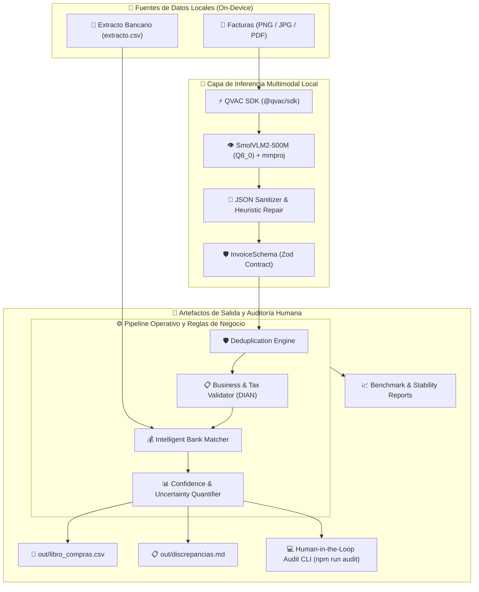

# 🏗️ Arquitectura del Sistema: Tally

> **Tally: Local Autonomous Operations Agent for Financial Reconciliation**  
> Diseñado para el **Aleph Hackathon 2026** (Track: Local agents para operaciones / QVAC).

---

## 1. Diagrama de Arquitectura End-to-End



---

## 2. Contrato de Datos Compartido (`src/types.ts`)

La costura entre la inferencia de visión (Track A) y el pipeline de datos (Track B) es el objeto estricto **`Invoice`**:

```typescript
export const InvoiceSchema = z.object({
  proveedor: z.string(),
  nit: z.string().nullable(),
  numeroFactura: z.string().nullable(),
  fecha: z.string(), // Formato YYYY-MM-DD
  subtotal: z.number(),
  iva: z.number(),
  total: z.number(),
});
```

---

## 3. Capas de Resiliencia del Agente

### Capa 1: Resiliencia de Parseo
Si el modelo VLM envuelve la respuesta en formato conversacional o markdown, el parser heurístico extrae el bloque `{...}` más externo y normaliza caracteres de moneda (`$`), separadores de miles (`.`) y comas decimales (`,`).

### Capa 2: Reglas Tributarias Determinísticas
- **Aritmética**: $\text{subtotal} + \text{iva} \equiv \text{total} \pm 2\text{ COP}$.
- **Algoritmo DIAN**: Verificación del dígito verificador de NIT usando pesos ponderados de módulo 11.
- **Tarifas de IVA válidas**: 19%, 5% y 0% (excluido).

### Capa 3: Conciliación Inteligente Multi-Transacción (Split Match)
Si un pago se realiza en cuotas o dos transferencias consecutivas, el algoritmo explora combinaciones de pares de líneas en el extracto dentro de una ventana de $\pm3$ días para cubrir el total de la factura sin intervención manual.

### Capa 4: Cuantificación de Confianza (Uncertainty Quantification)
El agente asigna un porcentaje de confianza (0-100%) a cada factura. Aquellas con anomalías se marcan para la **auditoría humana en 5 segundos**.
