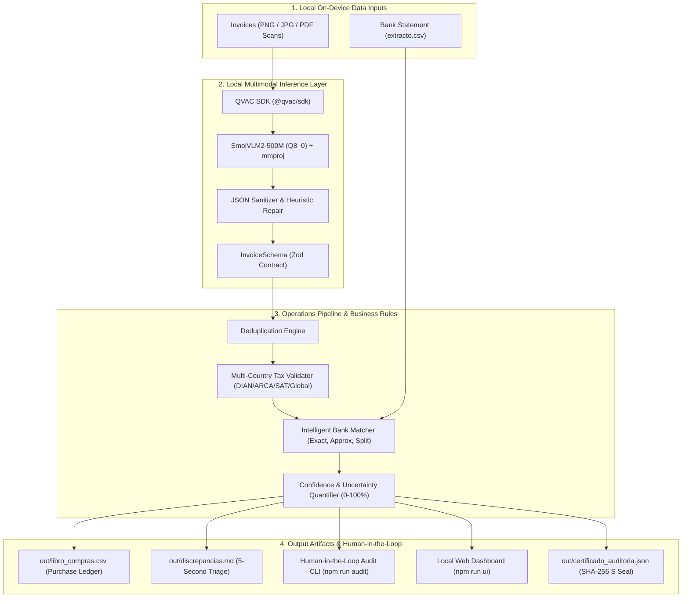

# System Architecture: Tally

> **Tally: Local Autonomous Operations Agent for Financial Reconciliation**  
> Built for the **Aleph Hackathon 2026** (Tether QVAC Track: Track 1 and Track 2).

---

## 1. End-to-End System Architecture



---

## 2. Shared Data Contract (`src/types.ts`)

The interface between multimodal vision inference (Track A) and the deterministic operational pipeline (Track B) is the strict **`Invoice`** contract:

```typescript
export const InvoiceSchema = z.object({
  proveedor: z.string(),
  nit: z.string().nullable(),
  numeroFactura: z.string().nullable(),
  fecha: z.string(), // YYYY-MM-DD format
  subtotal: z.number(),
  iva: z.number(),
  total: z.number(),
});
```

---

## 3. Four Layers of Agent Resilience

### Layer 1: Parsing Resilience & Schema Normalization
When small vision models output conversational preambles or markdown fences, the heuristic parser extracts the outermost `{...}` JSON block, strips non-numeric currency symbols (`$`, `USD`, `COP`), and standardizes decimal and thousands delimiters.

### Layer 2: Deterministic Multi-Jurisdiction Tax Validation
- **Arithmetic Verification**: $\text{subtotal} + \text{iva} \equiv \text{total} \pm 2\text{ units}$.
- **Checksum Algorithms**: DIAN (Colombia) and ARCA/AFIP (Argentina) weighted Modulo 11 verification digits.
- **Valid VAT Schedules**: Jurisdiction-specific rates (Colombia: 19%, 5%, 0%; Argentina: 21%, 10.5%, 27%; Mexico: 16%, 8%).

### Layer 3: Multi-Transaction Split-Payment Matching
When an invoice is paid across multiple bank wire transfers (e.g. advance payment + delivery settlement), the matching algorithm evaluates transaction pairs within a $\pm3$ day window to match the total with zero human overhead.

### Layer 4: Uncertainty Quantification & 5-Second Escalation
The agent assigns a calibrated confidence score (0-100%) to each document based on OCR quality, arithmetic precision, tax ID validity, and bank matching. Anomalous or low-confidence invoices are routed to the **5-second human audit card** for instant operator resolution.
