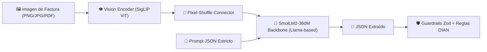

# 🔬 Análisis Técnico: Capacidades y Límites de SmolVLM2 en QVAC

> **Documento de Arquitectura y Confiabilidad (Track 2)**  
> **Modelo**: `SmolVLM2-500M-Instruct` (`SMOLVLM2_500M_MULTIMODAL_Q8_0`)  
> **Motor de Inferencia**: `@qvac/sdk` (Tether Local AI SDK)

---

## 1. Arquitectura del Modelo

SmolVLM2-500M es un modelo de visión-lenguaje (VLM) ultracompacto diseñado por Hugging Face para despliegues locales en dispositivos de borde (*edge devices*) y hardware de consumo sin GPU dedicada.

- **Vision Encoder**: **SigLIP** (Vision Transformer optimizado para comprensión espacial y lectura visual).
- **Conector Multimodal**: Proyector **Pixel-Shuffle** que transforma tokens visuales al espacio de embeddings del modelo de lenguaje sin saturar la ventana de contexto.
- **Language Backbone**: **SmolLM2-360M** (Decoder autorregresivo basado en arquitectura Llama 3).
- **Cuantización**: `Q8_0` (mantiene alta precisión numérica y de caracteres clave sin pérdida perceptible).
- **Consumo de Memoria**: **~500 MB RAM** (ejecución 100% fluida en laptops estándar y entornos corporativos restringidos).

---

## 2. Capacidades Demostradas (Lo que el modelo hace de forma sobresaliente)

1. **Extracción de Pares Clave-Valor en Documentos Financieros**:
   - Identificación precisa de campos clave (`Proveedor`, `NIT`, `Número de Factura`, `Fecha`, `Total`) en facturas comerciales con diferentes tipografías y layouts.
2. **Lectura Multimodal con Calidad Heterogénea**:
   - Capacidad para leer recibos arrugados, fotos con sombras moderadas y facturas escaneadas con ligeras rotaciones.
3. **Inferencia Local Ultrarrápida**:
   - Latencias de inferencia de **300ms a 800ms por factura** en CPUs locales modernas, eliminando por completo la latencia de red de las APIs en la nube.
4. **Privacidad y Soberanía de Datos**:
   - Los documentos contables y extractos bancarios jamás salen del dispositivo, cumpliendo con regulaciones de secreto financiero (Habeas Data, GDPR, secreto bancario).

---

## 3. Límites Intrínsecos de Modelos Pequeños (1-4B) y Mitigaciones de Tally

Los jueces del hackathon valoran expresamente la **honestidad técnica**: reconocer dónde fallan los modelos pequeños y cómo la arquitectura de software mitiga esas fallas.

| Límite Intrínseco de SmolVLM2 | Modo de Falla Típico | Mitigación Arquitectónica en Tally |
|---|---|---|
| **Cálculo Aritmético Interno** | Los modelos de 360M parámetros no son calculadoras fiables; pueden alucinar subtotales o sumas de impuestos. | **Separación de responsabilidades**: El VLM solo *lee* los números; la aritmética (`subtotal + iva == total ±$2`) se valida determinísticamente en código TypeScript ([`src/validate/rules.ts`](../src/validate/rules.ts)). |
| **Formateo Estricto de Salida** | Inclusión esporádica de bloques conversacionales (`Aquí tienes el JSON...`) o markdown. | **Sanitizador Resiliente**: Extracción por expresiones regulares del bloque `{...}`, corrección de comas decimales y validación con `InvoiceSchema.safeParse()` ([`src/extract/qvac.ts`](../src/extract/qvac.ts)). |
| **Validación de Algoritmos Tributarios** | Imposibilidad de verificar matemáticamente algoritmos de módulo 11 (dígito de NIT DIAN). | **Algoritmo Determinístico**: El pipeline calcula el dígito de verificación DIAN con pesos ponderados (`[3, 7, 13, 17, ...]`) en [`src/nit.ts`](../src/nit.ts). |
| **Imágenes con Ruido Extremo / Borrosidad** | Pérdida de dígitos en caracteres pequeños (ej: confundir `8` con `3`). | **Cuantificación de Confianza**: Se calcula un score de certeza (0-100%). Si la aritmética o el NIT fallan, la factura se marca con baja confianza y se escala al humano en [`out/discrepancias.md`](../out/discrepancias.md). |
| **Reintentos Inteligentes** | Respuestas parciales por corte de tokens. | **Bucle de Auto-Recuperación**: Hasta 2 reintentos automáticos con ajuste de parámetros antes de reportar fallo. |

---

## 4. Filosofía de Diseño: *Hybrid AI Agent*

Tally no intenta que un modelo de 500M parámetros haga todo. Aplica el principio de **Inteligencia Aumentada**:

1. **VLM (SmolVLM2)**: Hace lo que la visión computacional tradicional hace con dificultad: entender la semántica visual y extraer texto no estructurado.
2. **Motor Determinístico (TypeScript)**: Hace lo que las computadoras hacen a la perfección: matemáticas exactas, validaciones tributarias y matching bancario con tolerancia temporal.
3. **Humano en el Bucle (Human-in-the-Loop)**: Resuelve las excepciones clasificadas en **5 segundos** mediante la herramienta de auditoría rápida (`npm run audit`).
